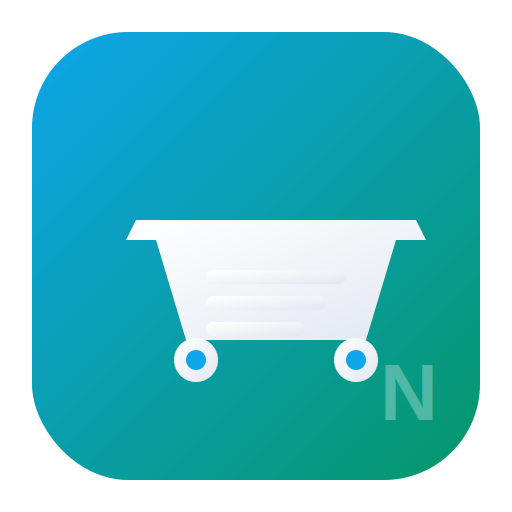

<div align="center">
  
  <h1>NEXUS Market AI</h1>
  <p><strong>ERP inteligente para supermercados, atacados e varejo alimentício</strong></p>
  <p>
    
    
    
    
  </p>
  <br/>
</div>

---

## Funcionalidades

<b>📊 Gestão Completa</b> · PDV · Estoque · Compras · Financeiro · RH · Fiscal · Frota · CRM · Delivery

| Módulo | Descrição |
|---|---|
| **Dashboard Executivo** | Indicadores em tempo real, gráficos de vendas, metas, performance |
| **PDV — Frente de Caixa** | Venda rápida, comandas, múltiplos pagamentos, NFC-e integrada |
| **Estoque Inteligente** | Curva ABC, validade/lotes, inventário, transferências entre filiais |
| **Compras** | Pedidos, cotação automática, recebimento, ranking de fornecedores |
| **Financeiro** | Contas a pagar/receber, DRE, fluxo de caixa, conciliação, crediário |
| **RH** | Funcionários, ponto eletrônico, folha de pagamento, férias, rescisão |
| **Fiscal** | NF-e, NFC-e, SPED, tributação por NCM/CST |
| **CRM & Fidelidade** | Programa de pontos, campanhas, histórico do cliente |
| **Delivery** | Gestão de entregas, rotas, motoristas, taxas |
| **Frota** | Veículos, manutenção, abastecimento, multas |
| **Relatórios** | 30+ relatórios gerenciais com exportação PDF/XLS |
| **IA** | Previsão de demanda, sugestão de preços, análise de perdas |

---

## Tecnologias

<div>
  <b>Frontend</b><br/>
  
  
  
  
  <br/><br/>
  <b>Backend</b><br/>
  
  
  
  
  
  <br/><br/>
  <b>Infra & DevOps</b><br/>
  
  
  
  
</div>

---

## Arquitetura

```
nexus-market/
├── frontend/           # SPA (Vanilla JS + Vite)
│   ├── public/         # Ícones, manifest, favicon
│   ├── src/
│   │   ├── pages/      # 30+ módulos do ERP
│   │   ├── components/ # Sidebar, Topbar, navegação
│   │   ├── services/   # Dexie.js (IndexedDB), API client
│   │   └── utils/      # Formatação, sanitização XSS
│   └── dist/           # Build de produção
├── backend/            # API REST (Node.js + Express)
│   ├── api/            # 28 rotas protegidas por JWT
│   ├── database/       # Sequelize models, migrations
│   ├── middleware/      # Auth, auditoria, rate-limit, upload
│   └── services/       # Email, cache, filas, push
├── docker-compose.yml  # Stack completo (backend + banco + redis)
├── deploy/             # Nginx config, SSL
└── Installer/          # Inno Setup — instalador Windows .exe
```

### Segurança embarcada

- 🔐 **JWT + bcrypt** — autenticação robusta, senhas hasheadas
- 🛡️ **Helmet + CSP** — headers de segurança, proteção XSS/Clickjack
- ⏱️ **Rate limiting** — 200 req/min API, 10 tentativas login
- 🚫 **Brute force lockout** — 5 falhas = 15 min de bloqueio
- 🔍 **Auditoria** — todas ações sensíveis registradas
- ✅ **Validação Zod** — schemas rigorosos em todas entradas
- 🧪 **XSS sanitization** — escapamento em toda interface

---

## Instalação

### 🪟 Windows — Instalador Profissional

```
Baixe o instalador em: Installer/output/nexus-market-ai-setup-4.0.0.exe
Execute como Administrador → Próximo → Concluir
```

O instalador cria atalhos no Menu Iniciar e Área de Trabalho.

**Pré-requisito:** [Node.js 18+](https://nodejs.org/) instalado no sistema.

### 🐳 Docker (recomendado para produção)

```bash
docker-compose up -d
docker-compose exec backend npm run migrate
docker-compose exec backend npm run seed
```

Acesse: `http://localhost:3000` · Login: `admin` / `admin`

### 🐧 Linux (manual)

```bash
cp backend/.env.example backend/.env
cd backend && npm install && cd ..
cd frontend && npm install && cd ..
cd frontend && npm run build && cd ..
cd backend && npm run migrate && npm run seed
cd backend && npm start &
cd frontend && npm run dev &
```

---

## Credenciais Padrão

| Papel | Login | Senha |
|---|---|---|
| Administrador | `admin` | `admin` |
| Gerente | `gerente` | `gerente` |
| Operador | `operador` | `operador` |

> ⚠️ **Produção:** altere todas as senhas imediatamente após a primeira instalação.

---

## Variáveis de Ambiente

| Variável | Obrigatório | Padrão | Descrição |
|---|---|---|---|
| `JWT_SECRET` | ✅ | `CHANGE-ME` | Chave secreta (mín. 32 caracteres) |
| `DB_HOST` | ✅ | `localhost` | Host do PostgreSQL |
| `DB_NAME` | ✅ | `nexus_market_ai` | Nome do banco |
| `DB_USER` | ✅ | `postgres` | Usuário do banco |
| `DB_PASS` | ✅ | `postgres` | Senha do banco |
| `NODE_ENV` | — | `development` | `development` ou `production` |
| `CORS_ORIGIN` | — | `http://localhost:3000` | Origem permitida |

> 🔑 Para gerar um JWT_SECRET seguro: `node -e "console.log(require('crypto').randomBytes(32).toString('hex'))"`

---

## Desenvolvimento

```bash
# Terminal 1 — Backend
cd backend
cp .env.example .env   # editar credenciais
npm install
npm run migrate && npm run seed
npm run dev            # nodemon — reload automático

# Terminal 2 — Frontend
cd frontend
npm install
npm run dev            # Vite — HMR na porta 3000
```

O frontend opera **standalone** com IndexedDB (Dexie.js) — não depende do backend para funcionalidades básicas. O backend adiciona multi-usuário, sincronização e integrações externas.

---

## Licença

MIT © 2024 NEXUS Market AI

---

<div align="center">
  <sub>Feito com ❤️ para o varejo brasileiro</sub>
</div>
